  &nbsp;
  

I'm Atharva, a developer from Pune who likes owning a product end to end: the model, the app around it, and sometimes the device it runs on. I studied Artificial Intelligence & Data Science at MMCOE, Pune (B.E., 2023–2026, CGPA 9.5), and I build production web apps for real businesses, mostly with Next.js, TypeScript and Supabase.

## Tools I reach for

| Area | Tools |
|---|---|
| Languages |  |
| Web |  |
| Backend and data |  |
| AI and ML |  &nbsp;plus Hugging Face Transformers, Groq, Deepgram |
| Hardware and ops |  |

## On GitHub

  <picture>
    <source media="(prefers-color-scheme: dark)" srcset="https://raw.githubusercontent.com/atharva-ni/atharva-ni/main/profile/stats-dark.svg">
    
  </picture>
  <picture>
    <source media="(prefers-color-scheme: dark)" srcset="https://raw.githubusercontent.com/atharva-ni/atharva-ni/main/profile/top-langs-dark.svg">
    
  </picture>

<picture>
  <source media="(prefers-color-scheme: dark)" srcset="https://raw.githubusercontent.com/atharva-ni/atharva-ni/main/profile/snake-dark.svg">
  
</picture>

## Education and recognition

**B.E. in Artificial Intelligence & Data Science**, Marathwada Mitra Mandal's College of Engineering, Pune (2023–2026), CGPA 9.5 
**Diploma in Computer Technology**, K.K. Wagh Polytechnic, Nashik (2020–2023), 86.70%

Certifications and leadership

 

- Introduction to Cybersecurity, Cybersecurity Essentials, and Introduction to Packet Tracer (Cisco Networking Academy, 2024)
- SQL certification (HackerRank, 2024)
- Committee Head for ACTS 2022, running the event's activities and competitions end to end
- Fire Detection & Security Robot presented at Dipex 2022, a state-level student project exhibition

---

The quickest way to reach me is [LinkedIn](https://www.linkedin.com/in/atharva-nighot-223a16212) or [atharva.nighot0030@gmail.com](mailto:atharva.nighot0030@gmail.com). I'm always happy to talk about Next.js and Supabase architecture, fine-tuning small transformers, or getting a Raspberry Pi to behave in production.
